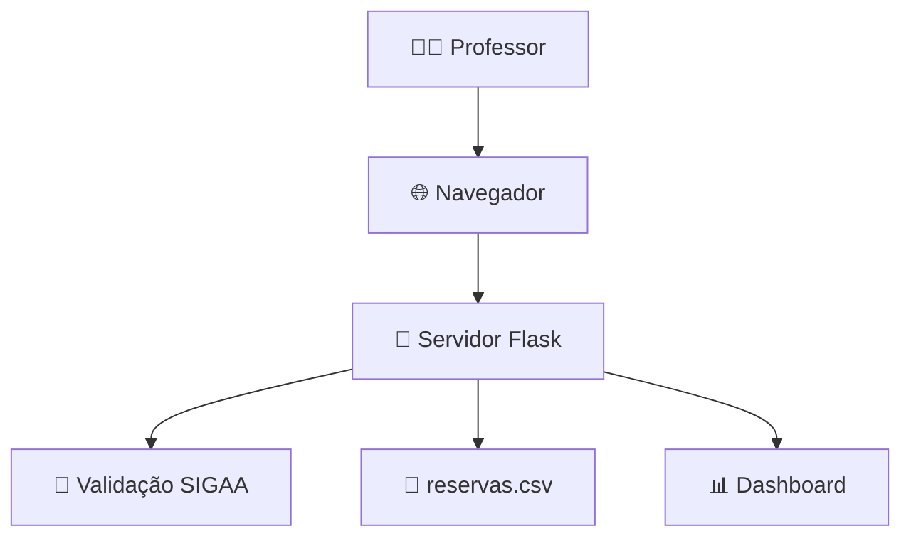
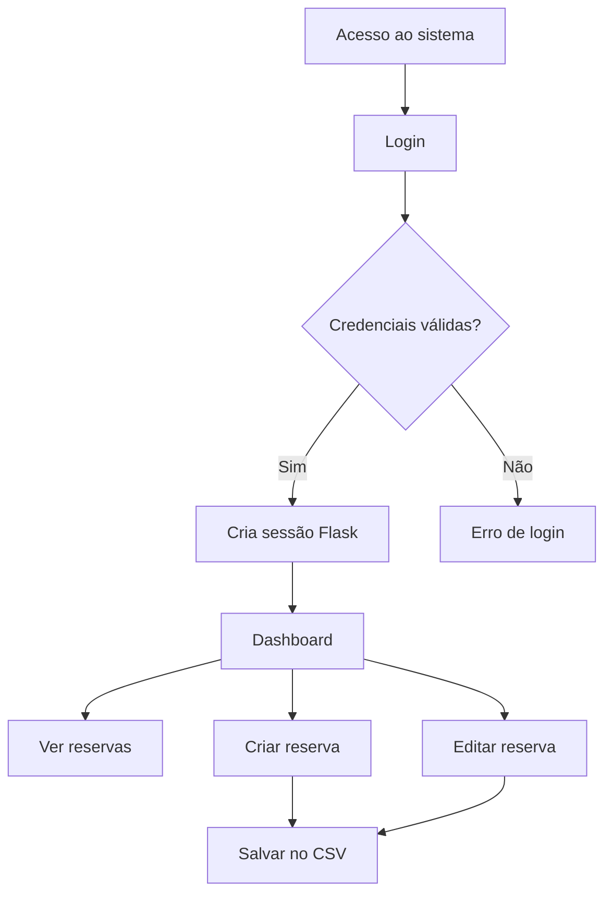

# 🧪 Sistema de Reservas UFOPA — Campus Oriximiná


Sistema web simples e responsivo para **agendamento do Laboratório de Informática** da UFOPA — Campus Oriximiná.  
Desenvolvido para facilitar o **controle de aulas e reservas pelos docentes**.

---

# ✨ Funcionalidades

🔐 **Login integrado ao SIGAA**  
📅 **Reserva de aulas e horários**  
🚫 **Bloqueio automático de conflitos**  
🚦 **Status em tempo real das aulas**  
📱 **Interface responsiva (Mobile First)**

---

# 🛠️ Tecnologias

- 🐍 **Python**
- 🌐 **Flask**
- 🎨 **HTML + CSS + JavaScript**
- 🔗 **Requests + BeautifulSoup**
- 📄 **CSV (persistência leve)**

---

# 🧭 Arquitetura do Sistema



---

# ⚙️ Fluxo da Aplicação (Flask)



---

# 📊 Estrutura do Projeto

```bash
/
├── app.py
├── reservas.csv
├── static/
│   ├── css/
│   │   ├── style.css
│   │   └── login.css
│   └── js/
│       ├── script.js
│       └── login.js
└── templates/
    ├── login.html
    ├── index.html
    └── editar.html
```

---

# 🚀 Instalação

### 1️⃣ Clonar repositório

```bash
git clone https://github.com/FelipeMzero/reserva-ufopa-orixi.git
```

### 2️⃣ Instalar dependências

```bash
pip install flask requests beautifulsoup4
```

### 3️⃣ Executar aplicação

```bash
python app.py
```

### 4️⃣ Acessar

```
http://localhost:5000
```

---

# 👨‍💻 Projeto

👨‍💻 **Felipe Monteiro**  
🏫 **Universidade Federal do Oeste do Pará — UFOPA**  
📍 Campus **Oriximiná — Pará**  
📅 **2026**
