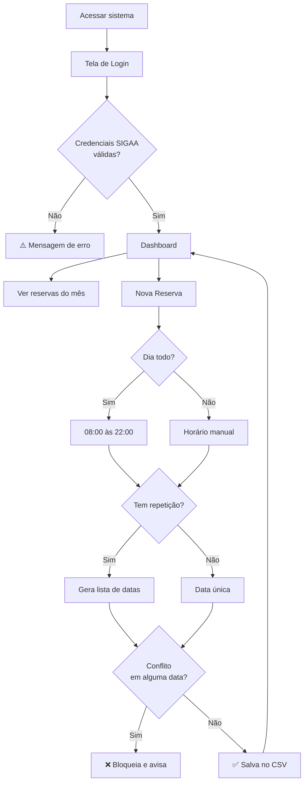

<div align="center">

<br>

# 🏛️ Reservas UFOPA
### Sistema de Gestão de Espaços e Frota
**Campus Oriximiná — Universidade Federal do Oeste do Pará**

<br>

[](https://python.org)
[](https://flask.palletsprojects.com)
[](.)
[](.)

<br>

> Professores reservam laboratórios, salas, auditório, áreas comuns e veículos  
> diretamente pelo celular ou notebook — **sem risco de conflito de horários**.

<br>

</div>

---

## 📋 Índice

- [✨ Funcionalidades](#-funcionalidades)
- [🔐 Login](#-como-fazer-o-login)
- [📅 Como Reservar](#-como-fazer-uma-reserva)
- [🏢 Espaços Disponíveis](#-espaços-e-recursos-disponíveis)
- [🔁 Tipos de Reserva](#-tipos-de-reserva)
- [📊 Gerenciamento](#-gerenciamento-de-datas)
- [🛠️ Tecnologias](#️-tecnologias)
- [🧭 Arquitetura](#-arquitetura-do-sistema)
- [🚀 Instalação](#-instalação-e-execução)

---

## ✨ Funcionalidades

<br>

| &nbsp; | Funcionalidade | Descrição |
|:---:|---|---|
| 🔐 | **Login SIGAA** | Autenticação com credenciais institucionais já existentes |
| 🏢 | **Múltiplos Espaços** | Labs, salas, auditório, bosque e frota de veículos |
| 🚫 | **Anti-conflito** | Bloqueio automático de sobreposição de horários |
| 🔁 | **Reservas Recorrentes** | Diária, semanal, mensal ou anual com data de fim |
| 🟢 | **Status em Tempo Real** | Agendada → Executando → Realizada, atualizado a cada acesso |
| 📅 | **Filtro por Mês** | Navegação entre meses sem poluição visual |
| ✏️ | **Editar / Excluir** | Apenas o dono da reserva pode alterar ou remover |
| 📱 | **Mobile First** | Interface totalmente responsiva para celular |

---

## 🔐 Como fazer o Login

O sistema **não exige novo cadastro**. Use exatamente as mesmas credenciais do portal SIGAA da UFOPA.

```
Usuário:  nome.sobrenome   (ex: joao.silva)
Senha:    sua senha do SIGAA
```

> **Como funciona internamente:** o backend realiza autenticação por web scraping diretamente no SIGAA — se as credenciais forem aceitas lá, a sessão é criada aqui. Sua senha **não é armazenada** em nenhum momento.

<br>

**Possíveis mensagens de erro:**

| Mensagem | Causa |
|---|---|
| *"Usuário ou senha inválidos"* | Credencial errada — cheque no portal do SIGAA |
| *"SIGAA temporariamente indisponível"* | Servidor da UFOPA fora do ar — tente em instantes |

---

## 📅 Como fazer uma Reserva

**1.** Acesse o **Dashboard** após o login  
**2.** Preencha o formulário **Nova Reserva** no topo da página:

| Campo | Descrição |
|---|---|
| **Nome da Atividade** | Ex: `Redes de Computadores`, `Palestra`, `Viagem de Campo` |
| **Local / Recurso** | Selecione o espaço ou veículo desejado |
| **Data Inicial** | Data da reserva (ou início da recorrência) |
| **Hora Início / Hora Fim** | Intervalo de uso |
| **Reservar o Dia Todo** | Preenche automaticamente `08:00 às 22:00` |
| **Repetir Reserva** | Define o tipo de recorrência |
| **Repetir até a Data** | Data final da série de repetições |

**3.** Clique em **Confirmar Reserva**

> ⚠️ Se o horário já estiver ocupado, o sistema exibirá uma mensagem de conflito com os detalhes da reserva bloqueante — **nada é salvo**.

---

## 🏢 Espaços e Recursos Disponíveis

```
📐 Laboratórios
   ├── Lab. de Informática
   └── Lab. Multidisciplinar

🏫 Salas de Aula
   ├── Sala 00 (Tela Interativa)
   └── Sala 01, 02, 03, 04

🌳 Espaços Comuns
   ├── Auditório
   ├── Bosque Qualy Gonçalves
   └── Quadra de Areia

🚗 Frota
   ├── Veículo L200
   └── Veículo Van
```

---

## 🔁 Tipos de Reserva

### Reserva Simples
Preencha normalmente sem selecionar repetição. Uma única entrada é criada.

### Reserva Recorrente
Selecione o tipo de repetição e informe a **data de término**:

| Tipo | Comportamento | Exemplo |
|---|---|---|
| **Diariamente** | Uma reserva por dia | Lab. todos os dias úteis da semana |
| **Semanalmente** | Mesma data da semana | Toda terça-feira até o fim do semestre |
| **Mensalmente** | Mesmo dia do mês | Todo dia 15 de cada mês |
| **Anualmente** | Mesma data todo ano | Evento anual do campus |

> 🔒 **Limite de segurança:** máximo de 365 ocorrências por série.  
> ❌ **Conflito em lote:** se qualquer data da série tiver conflito, **toda a série é bloqueada** e nenhuma reserva é salva.

### Reserva de Dia Todo
Marque **"Reservar o Dia Todo"** — os campos de horário são preenchidos automaticamente com `08:00 às 22:00`. Ideal para viagens de campo ou simpósios.

---

## 📊 Gerenciamento de Datas

### Status Dinâmico

Toda vez que o painel é carregado, o servidor classifica cada reserva com base no horário atual:

| Status | Cor | Condição |
|:---:|:---:|---|
| 🔵 **Agendada** | Azul | Reserva futura ou que ainda não começou hoje |
| 🟡 **Executando** | Amarelo pulsante | Hora atual está dentro do intervalo da reserva |
| ✅ **Realizada** | Verde | Hora de fim já passou |

### Filtro por Mês
- O painel abre automaticamente no **mês atual**
- Use o seletor para navegar entre meses
- Clique em **✕ Limpar** para ver todas as reservas
- Um resumo abaixo da tabela mostra o total visível

### Editar / Excluir
- **Editar** — visível apenas nas suas próprias reservas; o sistema revalida conflitos excluindo a própria reserva da verificação *(sem falso positivo)*
- **Excluir** — confirme o alerta; a reserva é removida permanentemente
- Reservas de outros professores exibem `—` no lugar dos botões

---

## 🛠️ Tecnologias

| Camada | Tecnologia |
|---|---|
| **Backend** | Python 3.10+ · Flask |
| **Autenticação** | `requests` + web scraping no SIGAA |
| **Frontend** | HTML5 · CSS3 · JavaScript vanilla |
| **Persistência** | CSV — leve, sem banco de dados |
| **Tipografia** | Sora + DM Sans via Google Fonts |

---

## 🧭 Arquitetura do Sistema

```mermaid
graph TD
    A[👨‍🏫 Professor] --> B[🌐 Navegador / Celular]
    B --> C[🐍 Servidor Flask]
    C --> D[🔐 Auth SIGAA\nweb scraping]
    C --> E[📄 reservas.csv\nbanco de dados]
    C --> F[📊 Dashboard\nstatus em tempo real]
    D -->|sucesso| G[✅ Sessão criada]
    D -->|falha|   H[❌ Erro de login]
    E --> I[🚫 Anti-conflito\nverifica sobreposição]
    E --> J[🔁 Motor de Repetição\ntimedelta + calendar]
```

<br>



---

## 📁 Estrutura do Projeto

```
reserva-ufopa/
│
├── 📄 app.py                  # Servidor Flask + todas as rotas
├── 🔐 auth_sigaa.py           # Módulo de autenticação SIGAA
├── 🖼️  baixar_logo.py          # Script para salvar logo localmente
├── 🗃️  reservas.csv            # Banco de dados (gerado automaticamente)
│
└── 📂 static/
    ├── css/
    │   └── style.css          # Estilos globais (Sora + DM Sans)
    ├── js/
    │   └── script.js          # Filtro, validações, interatividade
    └── img/
        └── logo.png           # Logo UFOPA

└── 📂 templates/
    ├── login.html             # Tela de autenticação
    ├── index.html             # Dashboard principal
    └── editar.html            # Formulário de edição
```

---

## 🚀 Instalação e Execução

### 1. Clonar o repositório
```bash
git clone https://github.com/FelipeMzero/reserva-ufopa-orixi.git
cd reserva-ufopa-orixi
```

### 2. Instalar dependências
```bash
pip install flask requests beautifulsoup4
```

### 3. Baixar a logo localmente *(recomendado)*
```bash
python baixar_logo.py
```

### 4. Executar o servidor
```bash
python app.py
```

### 5. Acessar no navegador
```
http://localhost:5000
```

---

<div align="center">

<br>

Desenvolvido com 💙 por **Felipe Monteiro**

🏫 Universidade Federal do Oeste do Pará — **UFOPA**  
📍 Campus **Oriximiná · Pará**  
📅 2026

<br>

</div>
